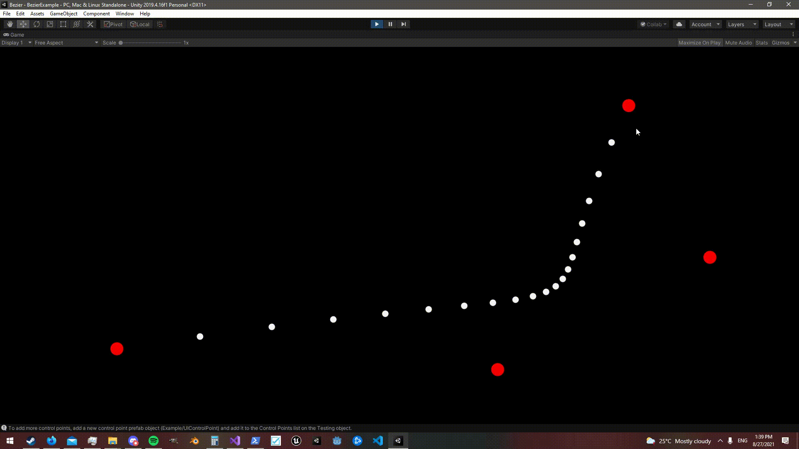

# Unity Bezier Curves
A simple C# library to create 2D Bezier curves of any order in Unity3D.


###### Example of a cubic bezier curve

## What does it provide?

Support for:

- Interpolating with Quadratic Bezier Curves
- Interpolating with Cubic Bezier Curves
- Interpolating with N order bezier curves (as many control points as you need)

The system uses Unity's `Transform` class as the control point data type.

To get an idea of what the system can do, open the project in Unity and go to the example scene.

All of the functionality of this repository is contained in the Bezier.cs file, so you may discard everything else if you wish to do so.

## Examples:

**Plotting a bezier curve of N order? (any number of control points)**

Use the `NOrderBezierInterp` function.
```c#
List<Transform> controlPoints = new List<Transform>();
int pointCount = 20; //Number of points to plot the curve with

... //fill the controlPoints list with Transform objects

//Loop through values of i to create the graph, spawning points at each step
for (float i = 0; i < 1; i += 1f / pointCount)
{
    Vector2 point = Bezier.NOrderBezierInterp(controlPoints, i);

    DrawPoint(point); //Your function for drawing the point in unity. (Example of this in the example scene)
}
```

**Plotting a quadratic bezier curve?**

Use the `QuadraticBezierInterp` function.
```c#
/*
    Assign these in the inspector
*/
[SerializeField] Transform p1;
[SerializeField] Transform p2;
[SerializeField] Transform p3;

int pointCount = 20; //Number of points to plot the curve with

... //fill the list with Transform objects

//Loop through values of i to create the graph, spawning points at each step
for (float i = 0; i < 1; i += 1f / pointCount)
{
    Vector2 point = Bezier.QuadraticBezierInterp(p1, p2, p3, i);

    DrawPoint(point); //Your function for drawing the point in unity. (Example of this in the example scene)
}
```

## Keep in mind
If you know you will be working with Bezier curves of order 3 or 4 (quadratic or cubic), prefer the `QuadraticBezierInterp` or `CubicBezierInterp` functions over `NOrderBezierInterp`, as they're faster than `NOrderBezierInterp` for their respective order.


## Benchmarking
If you are concerned about performance, the Test.cs script can output benchmark diagnostics to help you decide if this project is right for you.

Simply uncomment the `#define BEZIER_BENCHMARK` at the top of the `Test.cs` file, and the runtime of the curve calculation will be outputted to the console.

You can change the interpolation function by modifiying the for loop in the update function for Test.cs.